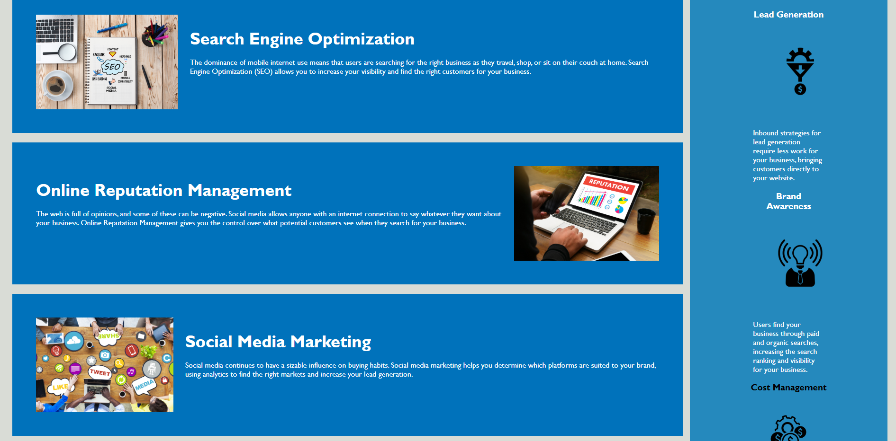

# Code refactor for Horiseon

I took existing code and fixed the syntax, links and a few other minor things. I made it more accessibale by reolacing div tags with more appropiate tags. I added alt descriptions for the img tags. More or less just cleaned up the code. 

[Code-Refactor](https://toveson.github.io/code-refactor/) Is hosted on Github pages.

This application was authored by [Trever Oveson](https://github.com/toveson).